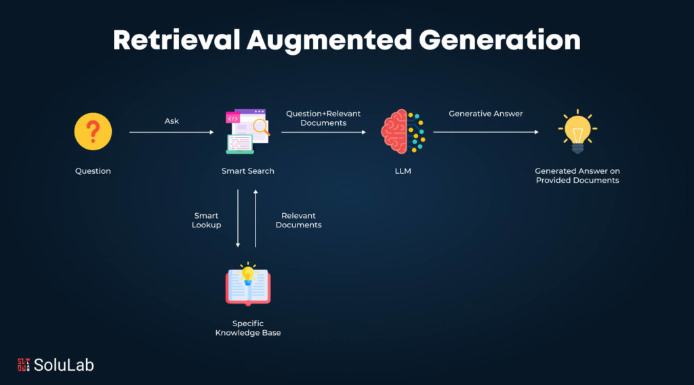

## Introduction

The patterns covered so far -- reasoning, tool use, and orchestration -- give agents the ability to think, act, and coordinate. But agents are limited by what they know. A model's parameters encode knowledge frozen at training time, which becomes stale, incomplete, or too general for domain-specific work. When an agent needs to answer questions about internal documents, recent research, or current data, it cannot rely on parametric memory alone. It needs a mechanism to retrieve relevant information at query time and incorporate it into its reasoning.

**Retrieval-Augmented Generation (RAG)** is the architectural pattern that addresses this gap. It combines information retrieval systems with generative language models so that responses are grounded in external, up-to-date, and inspectable knowledge rather than relying solely on model parameters. Instead of asking a model to answer a question directly, the system first retrieves relevant information from a corpus, then conditions the model on that information when generating the final answer. The language model remains a reasoning and synthesis engine, while the retriever acts as a dynamic memory.

This separation introduces a clear information workflow with two main phases -- **document ingestion** (offline) and **document retrieval** (online) -- followed by **generation**. The chapter begins with embeddings (the representation that makes semantic retrieval possible), then covers vector databases (the storage and search infrastructure), document ingestion (preparing a corpus for retrieval), document retrieval (the multi-stage pipeline from query to context), evaluation (measuring RAG quality), and references and attribution (tracing answers back to sources).
