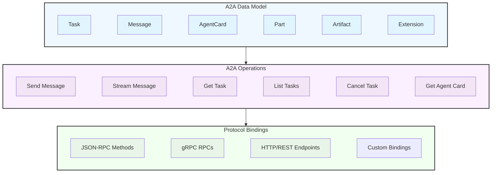

## 1. Introduction

The Agent2Agent (A2A) Protocol is an open standard designed to facilitate communication and interoperability between independent, potentially opaque AI agent systems. In an ecosystem where agents might be built using different frameworks, languages, or by different vendors, A2A provides a common language and interaction model.

This document provides the detailed technical specification for the A2A protocol. Its primary goal is to enable agents to:

- Discover each other's capabilities.
- Negotiate interaction modalities (text, files, structured data).
- Manage collaborative tasks.
- Securely exchange information to achieve user goals **without needing access to each other's internal state, memory, or tools.**

### 1.1. Key Goals of A2A

- **Interoperability:** Bridge the communication gap between disparate agentic systems.
- **Collaboration:** Enable agents to delegate tasks, exchange context, and work together on complex user requests.
- **Discovery:** Allow agents to dynamically find and understand the capabilities of other agents.
- **Flexibility:** Support various interaction modes including synchronous request/response, streaming for real-time updates, and asynchronous push notifications for long-running tasks.
- **Security:** Facilitate secure communication patterns suitable for enterprise environments, relying on standard web security practices.
- **Asynchronicity:** Natively support long-running tasks and interactions that may involve human-in-the-loop scenarios.

### 1.2. Guiding Principles

- **Simple:** Reuse existing, well-understood standards (HTTP, JSON-RPC 2.0, Server-Sent Events).
- **Enterprise Ready:** Address authentication, authorization, security, privacy, tracing, and monitoring by aligning with established enterprise practices.
- **Async First:** Designed for (potentially very) long-running tasks and human-in-the-loop interactions.
- **Modality Agnostic:** Support exchange of diverse content types including text, audio/video (via file references), structured data/forms, and potentially embedded UI components (e.g., iframes referenced in parts).
- **Opaque Execution:** Agents collaborate based on declared capabilities and exchanged information, without needing to share their internal thoughts, plans, or tool implementations.

For a broader understanding of A2A's purpose and benefits, see [What is A2A?](./topics/what-is-a2a.md).

### 1.3. Specification Structure

This specification is organized into three distinct layers that work together to provide a complete protocol definition:

**Layer 1: Canonical Data Model** defines the core data structures and message formats that all A2A implementations must understand. These are protocol agnostic definitions expressed as Protocol Buffer messages.

**Layer 2: Abstract Operations** describes the fundamental capabilities and behaviors that A2A agents must support, independent of how they are exposed over specific protocols.

**Layer 3: Protocol Bindings** provides concrete mappings of the abstract operations and data structures to specific protocol bindings (JSON-RPC, gRPC, HTTP/REST), including method names, endpoint patterns, and protocol-specific behaviors.

This layered approach ensures that:

- Core semantics remain consistent across all protocol bindings
- New protocol bindings can be added without changing the fundamental data model
- Developers can reason about A2A operations independently of binding concerns
- Interoperability is maintained through shared understanding of the canonical data model

### 1.4 Normative Content

In addition to the protocol requirements defined in this document, the file `spec/a2a.proto` is the single authoritative normative definition of all protocol data objects and request/response messages. A generated JSON artifact (`spec/a2a.json`, produced at build time and not committed) MAY be published for convenience to tooling and the website, but it is a non-normative build artifact. SDK language bindings, schemas, and any other derived forms **MUST** be regenerated from the proto (directly or via code generation) rather than edited manually.

**Change Control and Deprecation Lifecycle:**

- Introduction: When a proto message or field is renamed, the new name is added while existing published names remain available, but marked deprecated, until the next major release.
- Documentation: Migration guidance MUST be provided via an ancillary document when introducing major breaking changes.
- Anchors: Legacy documentation anchors MUST be preserved (as hidden HTML anchors) to avoid breaking inbound links.
- SDK/Schema Aliases: SDKs and JSON Schemas SHOULD provide deprecated alias types/definitions to maintain backward compatibility.
- Removal: A deprecated name SHOULD NOT be removed earlier than the next major version after introduction of its replacement.

**Automated Generation:**

The documentation build generates `specification/json/a2a.json` on-the-fly (the file is not tracked in source control). Future improvements may publish an OpenAPI v3 + JSON Schema bundle for enhanced tooling.

**Rationale:**

Centering the proto file as the normative source ensures protocol neutrality, reduces specification drift, and provides a deterministic evolution path for the ecosystem.
