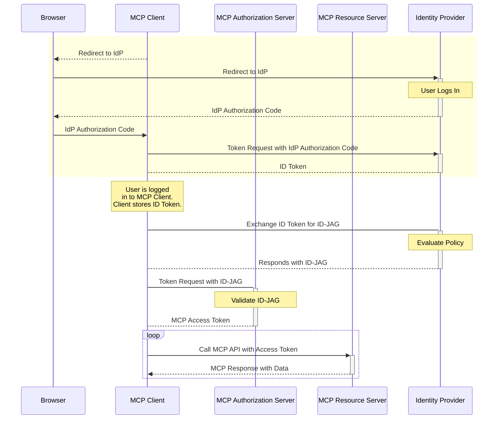

# SEP-990: Enable enterprise IdP policy controls during MCP OAuth flows
Source: https://modelcontextprotocol.io/community/seps/990-enable-enterprise-idp-policy-controls-during-mcp-o

Enable enterprise IdP policy controls during MCP OAuth flows

  <Badge>
    Final
  </Badge>

  <Badge>
    Standards Track
  </Badge>

| Field         | Value                                                                         |
| ------------- | ----------------------------------------------------------------------------- |
| **SEP**       | 990                                                                           |
| **Title**     | Enable enterprise IdP policy controls during MCP OAuth flows                  |
| **Status**    | Final                                                                         |
| **Type**      | Standards Track                                                               |
| **Created**   | 2025-06-04                                                                    |
| **Author(s)** | Aaron Parecki ([@aaronpk](https://github.com/aaronpk))                        |
| **Sponsor**   | None                                                                          |
| **PR**        | [#646](https://github.com/modelcontextprotocol/modelcontextprotocol/pull/646) |

***

## Abstract

This extension is designed to facilitate secure and interoperable authorization of MCP clients within corporate environments, leveraging existing enterprise identity infrastructure.

* For end users, this removes the need to manually connect and authorize the MCP Client to individual services within the organization.
* For enterprise admins, this enables visibility and control over which MCP Servers are able to be used within the organization.

## How Has This Been Tested?

We have an end to end implementation of this [here](https://github.com/oktadev/okta-cross-app-access-mcp), and in-progress MCP implementations with some partners.

## Breaking Changes

This is designed to augment the existing OAuth profile by providing an alternative when used under an enterprise IdP. MCP clients can opt in to this profile when necessary.

## Additional Context

For more background on this problem, you can refer to my blog post about this here:

[Enterprise-Ready MCP](https://aaronparecki.com/2025/05/12/27/enterprise-ready-mcp)

I also presented this at the MCP Dev Summit in May.

A high level overview of the flow is below:

> \[!IMPORTANT]
> **State:** Ready to Review
